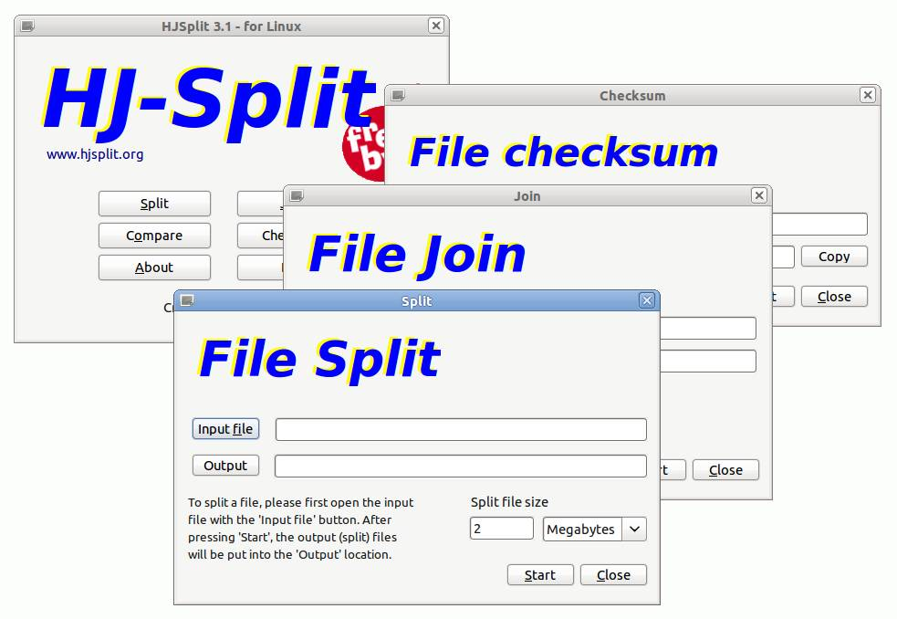

Untuk yang sering unduh file besar dari internet pasti sudah sering mendapat
berkas yang terbagi menjadi beberapa bagian/part. Biasanya file yang terbagi
memiliki ekstensi `*.001` sampai `*.XXX` sebanyak jumlah bagiannya. Untuk dapat
membuka berkas tersebut kita harus menggabungkannya menjadi satu terlebih
dahulu.

<!--more-->

Untuk menggabungkan berkas tersebut dapat menggunakan beberapa cara berikut:

### 1. HJ-Split

HJ-Split merupakan aplikasi untuk membagi dan menggabungkan berkas yang paling
umum digunakan. HJ-Split tersedia untuk berbagai platform sistem operasi,
termasuk GNU/Linux. HJ-Split untuk sistem operasi GNU/Linux dapat diunduh dari
<http://www.hjsplit.org/linux/>.

Untuk menjalankannya pun cukup mudah, cukup ekstrak berkas yang telah kita
unduh, masuk ke dalam _folder_-nya, lalu jalankan perintah

```
$ ./hjsplit
```



### 2. lxSplit

lxSplit merupakan aplikasi yang digunakan untuk membagi dan menggabungkan berkas
pada platform Linux, FreeBSD, OpenBSD, dan sistem operasi 'UNIX-like' lainnya.
lxSplit cocok dan saling kompatibel dengan HJ-Split.

Untuk memasang lxSplit dapat menggunakan perintah:

```
# pacman -S lxsplit
```

Untuk membagi berkas jalankan perintah

```
$ lxsplit -s hugefile.bin 15M
```

Perintah di atas akan membagi `hugefile.bin` menjadi beberapa bagian dengan
ukuran 15M, menghasilkan `hugefile.bin.001` sampai `hugefile.bin.XXX`.

Untuk menggabungkan berkas, dapat menjalankan perintah

```
$ lxsplit -j hugefile.bin.001
```

### 3. `cat` dan `split`

`cat` dan `split` merupakan perintah yang terdapat pada _package_ `coreutils`.
`coreutils` sendiri sudah menjadi _package default_ untuk sistem operasi
GNU/Linux, jadi kita tidak perlu memasang aplikasi tambahan lagi.

#### Membagi berkas

Untuk membagi berkas menjadi beberapa bagian, dapat menggunakan perintah

```
$ split -b 15m hugefile.bin
```

Perintah di atas tidak akan memberitahukan progres pembagian berkas. Untuk
melihat progres yang sedang berlangsung dapat menambahkan `--verbose`.

```
$ split -b 15m hugefile.bin --verbose
```

Dengan perintah di atas, berkas hugefile.bin akan terbagi menjadi beberapa
berkas dengan nama `xaa`, `xab`, dan seterusnya. Untuk membagi berkas dan
menghasilkan nama seperti pada HJ-Split, dapat menggunakan perintah

```
$ split -b 15M -d -a 3 hugefile.bin hugefile.bin. --verbose
```

##### Penjelasan

-   `-b 15M` akan membagi berkas menjadi 15\*1024 byte per berkas nya.
-   `-d` menggunakan nomor sebagai _suffixes_, jika tanpa opsi `-d` _suffixes_
    yang digunakan adalah abjad, `xaa`, `xab`, dan seterusnya.
-   `-a 3` opsi untuk mengatur panjang _suffixes_ sehingga panjang _suffixes_
    menjadi 3, `001`, `002`, dan seterusnya.
-   `hugefile.bin` berkas yang akan dibagi
-   `hugefile.bin.` nama setelah dibagi, diberi akhiran titik agar hasilnya
    menjadi `hugefile.bin.001`, `hugefile.bin.002`, dan seterusnya.

#### Menggabungkan berkas

Untuk menggabungkan berkas dapat menggunakan `cat`, dengan perintah seperti
berikut

```
$ cat hugefile.bin.* > hugefile.bin
```

Perintah di atas bertujuan untuk menggabungkan semua berkas yang berawalan
`hugefile.bin.` dan menaruh hasil penggabungan pada `hugefile.bin` Sebenarnya
untuk memisah dan menggabungkan file bisa juga menggunakan pengarsip seperti
`7zip`, `file-roller`, atau `x-archiver`. Hanya saja hasilnya berupa berkas
terkompresi, dan tidak saling kompatibel dengan HJ-Split.

Sekian.
