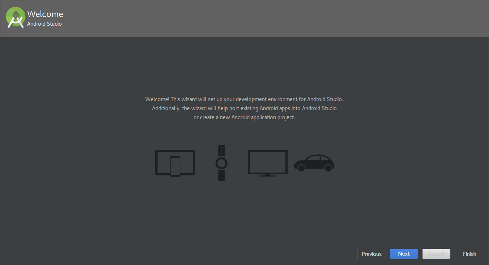
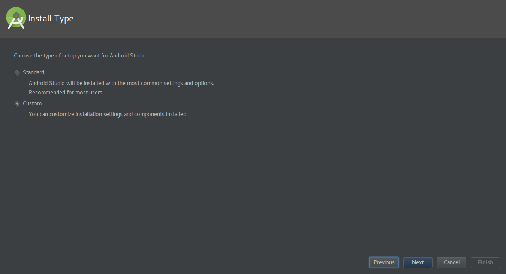
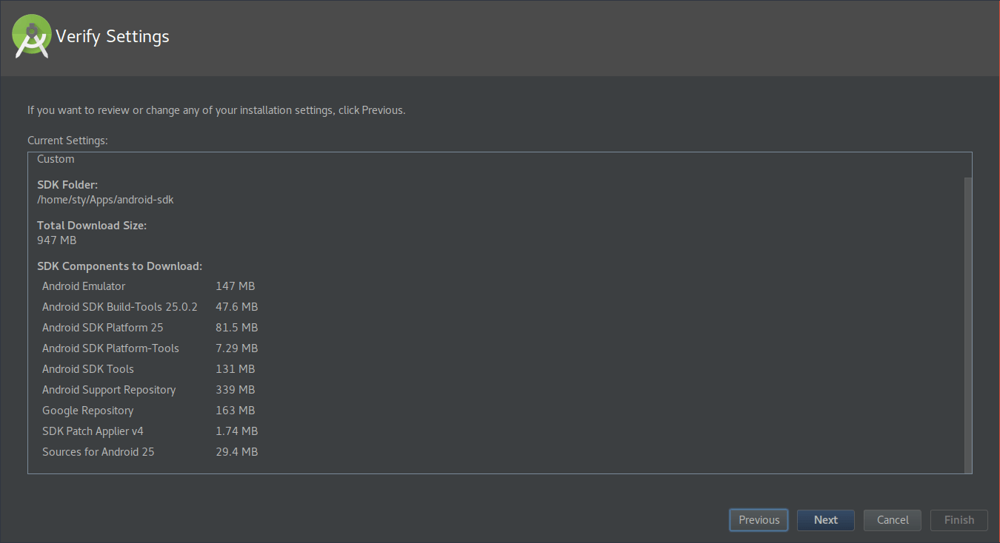

Bosan _coding_ menggunakan PHP akhirnya saya iseng-iseng mau mencoba pemrograman
Android. Pertama, saya install Android Studio. Android Studio sendiri merupakan
Integrated Development Environment (IDE) ofisial untuk membuat aplikasi Android.

<!--more-->

### Kebutuhan

-   Unduh Android Studio untuk GNU/Linux di:  
    <https://developer.android.com/studio/index.html#downloads>
-   Install dependensi: lib32z1, lib32ncurses5, dan lib32stdc++6.

### Instal dependensi

```
# apt install lib32z1 lib32ncurses5 lib32stdc++6
```

### Instal Android Studio

Ekstrak hasil unduh

```
$ unzip android-studio-ide-xxx.xxxxxxx-linux.zip -d /path/to/dir
```

Ubah `/path/to/dir` dengan direktori tempat kita ingin menaruh file instalasi
Android Studio.

```
$ cd /path/to/dir/android-studio

$ ./bin/studio.sh
```

Ikuti proses instalasi sampai selesai seperti pada gambar

   


### Membuat Link

Instalasi Android Studio selesai, tetapi untuk menjalankannya kita harus
memanggil melalui command-line pada folder android studio. Untuk mempersingkat
proses dalam menjalankan Android Studio kita bisa membuat link agar Android
Studio dapat dijalankan dari command-line di folder mana saja.

```
# ln -s /path/to/android-studio/bin/studio.sh /bin/android-studio
```

Setelah itu Android Studio dapat dijalankan di folder mana saja dengan
menggunakan perintah `android-studio`.

### Membuat Launcher

Instalasi Android Studio selesai, tetapi untuk menjalankannya kita harus
memanggil melalui command-line. Untuk alternatif, dapat dibuat _desktop
launcher_ agar Android Studio dapat dijalankan melalui menu. Buat file baru pada
`/home/user/.local/share/applications/android-studio.desktop` atau
`/usr/share/applications/android-studio.desktop` dengan isi sebagai berikut:

```
[Desktop Entry]
Version=1.0
Type=Application
Name=Android Studio
Exec=android-studio %f
Icon=android-studio
Comment=The official Android IDE
Categories=Development;IDE;
Terminal=false
StartupNotify=true
StartupWMClass=jetbrains-studio
MimeType=application/x-extension-iml;
```
