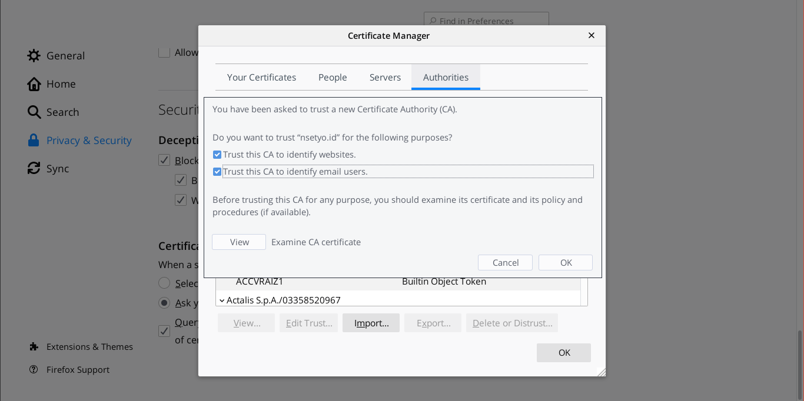

HTTPS rasanya sudah menjadi kewajiban saat ini, Chrome bahkan mengambil langkah
lebih serius dengan menampilkan label _Not secure_ pada laman http sejak 2018
pada versi 68[^1].

<!--more-->


Untuk menerapkan _service workers_ pada aplikasi berbasis web, w3c juga
mewakibkan aplikasi berada pada secure context[^2][^3]

> Service Workers are always secure contexts. Only secure contexts may register
> them, and they may only have clients which are secure contexts.

Untuk _service worker development_ server pada localhost sebenarnya sudah cukup
walau tanpa https, tetapi saya pribadi sering memberikan hostname untuk proyek
yang sedang saya kerjakan. Hostname selain localhost ini membuat _service
worker_ tidak dapat berjalan karena dianggap tidak berada pada lingkungan yang
aman. Salah satu cara mengatasi masalah ini adalah dengan mengubah konfigurasi
browser dan mengaktifkan mode testing[^4]. Tetapi untuk tulisan kali ini saya
akan memilih untuk membuat https certificate untuk dipasangkan pada server
lokal. Berikut adalah cara untuk membuat https certificate:

### Buat Certificate Authority

Pertama kita harus membuat sertifikat yang nantinya akan digunakan sebagai
_Certificate Authority_ untuk diimpor ke browser sebagai CA terpercaya dan dapat
digunaka nuntuk membuat sertifikat lainnya.

```shell
openssl req \
       -newkey rsa:4096 -nodes -keyout ca.key \
       -x509 -days 365 -out ca.crt
```

### Buat Certificate Request Untuk Setiap Server Lokal

Tahapan ini dilakukan untuk membuat sertifikat untuk masing-masing server lokal.

```shell
openssl req -new -newkey rsa:4096 -nodes -keyout hostname.key -out hostname.csr
```

Perlu diingat ketika mengisi informasi untuk Common Name/The FQDN isi dengan
hostname dari proyek yang akan diberi https

### Buat Sertifikat Dengan Sertifikat CA

Tahapan ini dilakukan untuk membuat sertifikat dengan menggunakan sertifikat
milik CA yang pertama kali dibuat pada tahapan-tahapan ini.

```
openssl x509 -req -in hostname.csr -CA ca.crt -CAkey ca.key \
        -CAcreateserial -out hostname.crt -days 356 -sha256
```

### Setting Server

Pada tulisan ini saya akan menggunakan nginx sebagai webserver. Tambahkan baris
berikut pada konfigurasi server dan restart server setelahnya.

```
server {
    listen              443 ssl;
    server_name         hostname;
    ssl_certificate     hostname.crt;
    ssl_certificate_key hostname.key;
    ...
}
```

Tambahkan konfigurasi berikut untuk selalu mengalihkan akses http ke https

```
server {
    listen 80      hostname;
    listen [::]:80 hostname ipv6only=on;

    return 301 https://$host$request_uri;
}
```

### Import Sertifikat CA

Pada tahap ini https sudah aktif tetapi browser masih menganggap kalau koneksi
tidak aman karena browser belum mempercayai penerbit sertifikat. Untuk mengatasi
masalah ini import sertifikat CA (ca.crt) ke browser




HTTPS sudah aktif dan dapat digunakan

[^1]:
    https://www.blog.google/products/chrome/milestone-chrome-security-marking-http-not-secure/

[^2]: https://w3c.github.io/webappsec-secure-contexts/#examples-service-workers
[^3]: https://w3c.github.io/webappsec-secure-contexts/#secure-contexts
[^4]: https://stackoverflow.com/a/34161385
