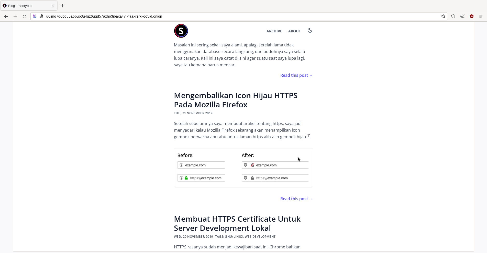

In a world where online privacy and security are becoming increasingly vital,
the advent of onion domains has emerged as a groundbreaking solution. Onion
domains, also known as Tor hidden services, offer a unique and anonymous way to
access websites while shielding the identities of both the website operators and
users. In this blog post, I will delve into the fascinating world of onion
domains, uncovering how to host an onion web server. This blog post will not
cover the mechanics, advantages, or ethical implications of using the Tor
network.

#### Connecting to the Tor Network

The first thing to do to join the Tor network is installing the Tor client. On
Linux we can do this by using command:

```bash
sudo apt install tor torsocks
```

After that, we can start the Tor service:

```bash
sudo systemctl start tor
```

Check the status of Tor service

```bash
sudo systemctl status tor
● tor.service - Anonymizing overlay network for TCP
     Loaded: loaded (/usr/lib/systemd/system/tor.service; disabled; preset: disabled)
    Drop-In: /usr/lib/systemd/system/service.d
             └─10-timeout-abort.conf
     Active: active (running) since Tue 2023-07-25 09:59:24 WIB; 1s ago
    Process: 668298 ExecStartPre=/usr/bin/tor --runasdaemon 0 --defaults-torrc /usr/share/tor/defaults-torrc -f /etc/tor/torrc --verify-config (code=exited, status=0/SUCCESS)
   Main PID: 668309 (tor)
      Tasks: 1 (limit: 23166)
     Memory: 57.2M
        CPU: 410ms
     CGroup: /system.slice/tor.service
```

#### Testing the tor connection

To test the Tor connection, first we need to know our IP address

```bash
wget -qO - https://api.ipify.org; echo

103.105.71.193
```

**103.105.71.193** is our IP address before using Tor network. Now we can
connect to Tor network using `torsocks` command

```bash
torsocks wget -qO - https://api.ipify.org; echo

185.220.101.77
```

We can see from the command result that our IP address is **185.220.101.77**

#### Create a Hidden Service

Creating a website on onion domain is as easy as creating a website on clearnet
(regular internet). All we have to do is connect to the Tor network and declare
a hidden service in Tor's config. To declare a hidden service, edit the torrc at
`/etc/tor/torrc` (might be different, depends on the installation of the Tor
client)

Here is the important line of the torrc:

```
HiddenServiceDir /var/lib/tor/other_hidden_service/
HiddenServicePort 80 localhost:80
```

`HiddenServicePort 80 localhost:80` means we declare hidden service on port 80
on our local server (I already have a normal web server listening on localhost
port 80). Restart the Tor service

```bash
sudo systemctl restart tor
```

Now we have declared the hidden service we host. To access the hidden service,
we need to know our onion domain. See the content of
`/var/lib/tor/other_hidden_service/hostname`.

```bash
cat /var/lib/tor/other_hidden_service/hostname

u6jmq7d6bgu5appup3u4qz6ugd57axho3ibaxa4vj7faakrzrkkoo5id.onion
```

The `u6jmq7d6bgu5appup3u4qz6ugd57axho3ibaxa4vj7faakrzrkkoo5id.onion` from
`hostname` is our onion domain. That is a real onion domain you can access using
Tor.



So easy isn't it?
