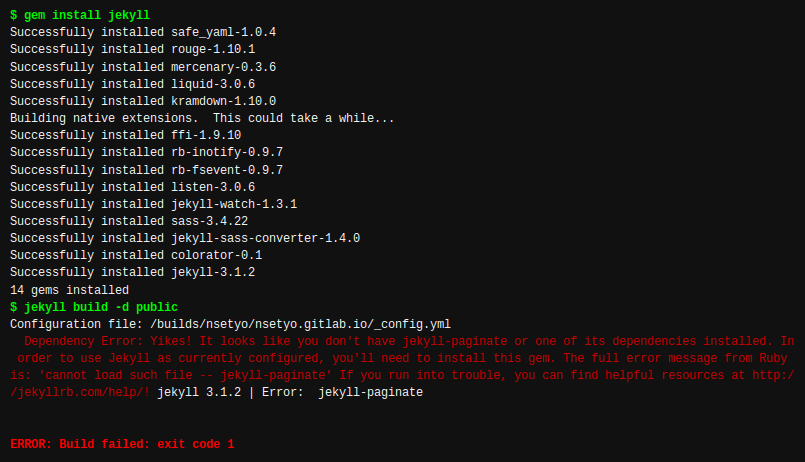

Salah satu kekurangan Github Pages adalah _private_ _repository_ hanya tersedia
untuk akun berbayar. Yang ingin menyembunyikan _repository_ dari static
websitenya tentu harus memiliki akun berbayar. Beberapa waktu lalu saya baru
tahu kalau ternyata Gitlab juga menyediakan fitur seperti Github Pages,
[Gitlab Pages][2].

Beberapa kelebihan Gitlab Pages dibandingkan dengan Github Pages antara lain:

1. _Private_ _repository_ untuk pengguna gratis tidak dibatasi.
2. Mendukung banyak Static Pages Generator.[^1]
3. Dukungan Large File Storage (LFS) secara gratis bagi yang ingin upload materi
   di repo.

<!--more-->

Berikut ini catatan saya dalam proses migrasi dari Github ke Gitlab Pages:

1. Nama repository menjadi username.gitlab.io dari yang semula
   username.github.io
2. Gitlab menyediakan beberapa _static website generator_, tidak seperti github
   yang hanya menyediakan jekyll untuk _build_ otomatis
3. Gitlab menyediakan _repository_ awal yang dapat kita _fork_ untuk memulai
   sebuah proyek Gitlab Pages dengan cepat.
4. Gitlab Pages dibuat menggunakan [Gitlab CI][3] yang membutuhkan sebuah file
   `.gitlab-ci.yml` di dalam _repository_ kita.

Bagi yang membuat proyek baru bisa dengan _fork_ proyek yang berada di
<https://gitlab.com/groups/pages>, _fork_ sesuai dengan _static website
generator_ yang ingin digunakan. Karena ingin migrasi dari _repository_ Github
ke Gitlab, yang saya lakukan antara lain:

### 1. Buat repository baru di Gitlab

Caranya mudah saja, klik tombol "+ New Project" lalu isikan `username.gitlab.io`
sebagai nama proyek.

### 2. Menabahkan Gitlab remote URL

Menambahkan Gitlab pada remote URL _repository_ yang sudah ada

```
$ git remote add gitlab git@gitlab.com:username/username.gitlab.io.git
```

### 3. Menambahkan `.gitlab-ci.yml`

Karena _repository_ ini berasal dari Github, maka kita harus membuat sendiri
`.gitlab-ci.yml` di dalam _repository_

```
$ touch .gitlab-ci.yml
```

Tambahkan teks berikut pada `.gitlab-ci.yml` :

```yaml
image: ruby:2.3

pages:
  stage: deploy
  script:
    - gem install jekyll
    - jekyll build -d public
  artifacts:
    paths:
      - public
  only:
    - master
```

### 4. Push ke Gitlab

Setelah semua perubahan sudah di-_commit_, lakukan _push_ ke remote URL Gitlab

```
$ git push gitlab
```

Untuk menjadikan gitlab sebagai _default remote_ untuk perintah _push_,
tambahkan `--set-upstream`

```
$ git push gitlab --set-upstream
```

Tunggu beberapa saat sampai proses build selesai.

### 5. Troubleshoot

Untuk memeriksa hasil build dapat dengan mengakses
https://gitlab.com/username/username.gitlab.io/builds. Ternyata Status build
_repository_ saya failed.



Saya lupa masalah dependensi 😁. Dependensi ini juga harus disertakan pada
`.gitlab-ci.yml`. Untuk mempermudah masalah dependensi saya menggunakan bundler.

Tambahkan file baru dengan nama `Gemfile`, dan isi sesuai kebutuhan

```bash
source 'https://rubygems.org'

gem 'jekyll'
gem 'jekyll-paginate'
gem 'jekyll-sitemap'
gem 'jekyll-feed'
gem 'jekyll-seo-tag'
gem 'jekyll-gist'
gem 'jekyll-redirect-from'
gem 'jekyll-compose', group: [:jekyll_plugins]
```

Berikutnya edit `.gitlab-ci.yml` menjadi

```yaml
image: ruby:2.3

pages:
  stage: deploy
  script:
    - bundle install
    - jekyll build -d public
  artifacts:
    paths:
      - public
  only:
    - master
```

Apabila sukses maka status pada halaman Builds menjadi _passed_ seperti terlihat
pada gambar berikut


<http://nsetyo.gitlab.io> sudah bisa diakses 😊.

### 6. Custom Domain

Langkah berikutnya adalah saya akan mengubah domain menggunakan domain
<https://nsetyo.id> seperti pada Github Pages. Caranya dengan mengakses Settings
> Pages. Lalu tambahkan domain yang diinginkan.

Sekian.

[1]: https://pages.github.com/
[2]: https://pages.gitlab.io/
[3]: https://about.gitlab.com/gitlab-ci/

[^1]: https://gitlab.com/groups/pages
