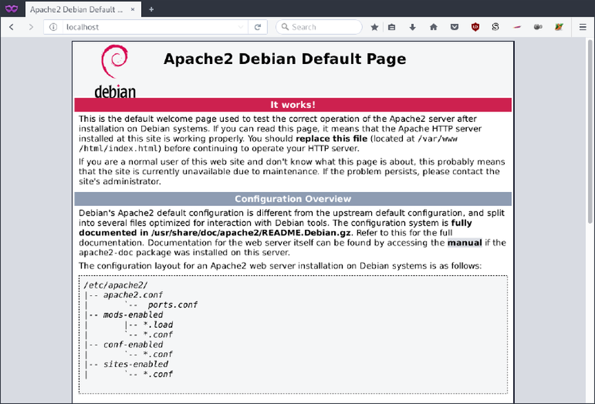
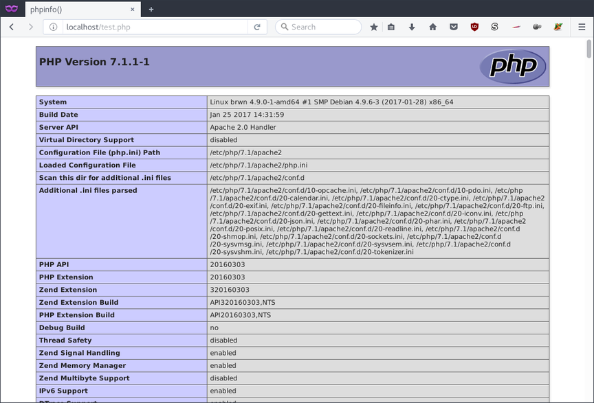

Berikut merupakan tahapan yang harus dilakukan untuk memasang Apache, MariaDB,
dan PHP pada komputer dengan sistem operasi GNU/Linux, khusunya Debian.

```
# apt update && apt install apache2 mariadb-server php
```

<!--more-->

Untuk memeriksa apakah instalasi apache berhasil atau tidak, buka browser lalu
akses <http://localhost>. Apabila akses berhasil maka apache telah terpasang dan
siap digunakan.



Periksa juga status _service_ mariadb

```
# systemctl status mariadb
```

```
● mariadb.service - MariaDB database server
   Loaded: loaded (/lib/systemd/system/mariadb.service; disabled; vendor preset: enabled)
   Active: active (running) since Tue 2017-02-14 21:13:58 WIB; 10h ago
 Main PID: 10526 (mysqld)
   Status: "Taking your SQL requests now..."
    Tasks: 27 (limit: 4915)
   CGroup: /system.slice/mariadb.service
           └─10526 /usr/sbin/mysqld

Feb 14 21:13:56 brwn systemd[1]: Starting MariaDB database server...
Feb 14 21:13:57 brwn mysqld[10526]: 2017-02-14 21:13:57 140195695858240 [Note] /usr/sbin/mysqld (mysqld 10.1.21-MariaDB-5) starting as process 10526
Feb 14 21:13:58 brwn systemd[1]: Started MariaDB database server.
```

Untuk memeriksa apakah PHP berhasil terpasang atau tidak bisa dengan membuat
file php untuk uji coba

```
# vim /var/www/html/test.php
```

Dengan isi file

```php
<?php

phpinfo();

```

Berikutnya akses http://localhost/test.php, jika berhasil maka browser akan
menampilkan informasi seperti gambar berikut:



Sekian.
