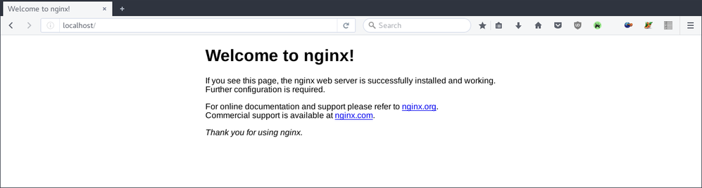
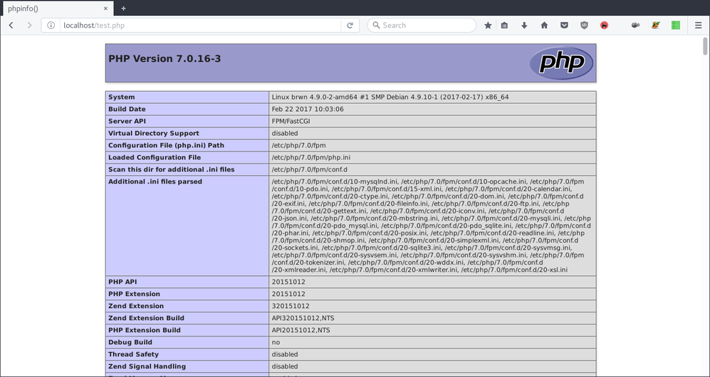

Untuk menginstal nginx jalankan perintah:

```
# apt instal nginx
```

Untuk memeriksa apakah instalasi nginx berhasil atau tidak, buka _browser_ lalu
akses <http://localhost>. Apabila akses berhasil maka nginx telah terpasang dan
siap digunakan.

<!--more-->



## Nginx dan PHP

Untuk dapat menggunakan php dengan nginx terlebih dahulu kita harus menginstall
`php-fpm`

```
# apt install php-fpm
```

Sunting file `/etc/php/{php-version}/fpm/php.ini`. Lalu ubah

```
;cgi.fix_pathinfo=1
```

Menjadi

```
cgi.fix_pathinfo=0
```

Restart php-fpm

```
# systemctl restart php{php-version}-fpm.service
```

Ubah juga `/etc/nginx/sites-available/default`, hilangkan komentar (tanda #)
pada:

```
#location ~ \.php$ {
#    include snippets/fastcgi-php.conf;
#
#    # With php-fpm (or other unix sockets):
#    fastcgi_pass unix:/var/run/php/php7.0-fpm.sock;
#    # With php-cgi (or other tcp sockets):
#    fastcgi_pass 127.0.0.1:9000;
#}

#location ~ /\.ht {
#    deny all;
#}
```

Menjadi:

```
location ~ \.php$ {
    include snippets/fastcgi-php.conf;

    # With php-fpm (or other unix sockets):
    fastcgi_pass unix:/run/php/php7.0-fpm.sock;
}

location ~ /\.ht {
    deny all;
}
```

Restrat nginx:

```
# systemctl restart nginx.service
```

Untuk memeriksa apakah PHP berhasil terpasang atau tidak bisa dengan membuat
berkas php untuk uji coba.

```
# vim /var/www/html/test.php
```

Dengan isi file

```php
<?php

phpinfo();
```

Berikutnya akses http://localhost/test.php, jika berhasil maka _browser_ akan
menampilkan informasi seperti gambar berikut:



Sekian.
