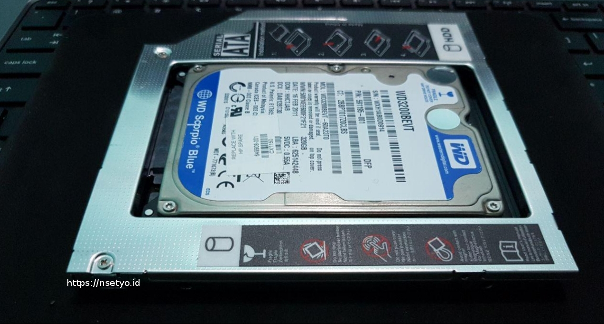
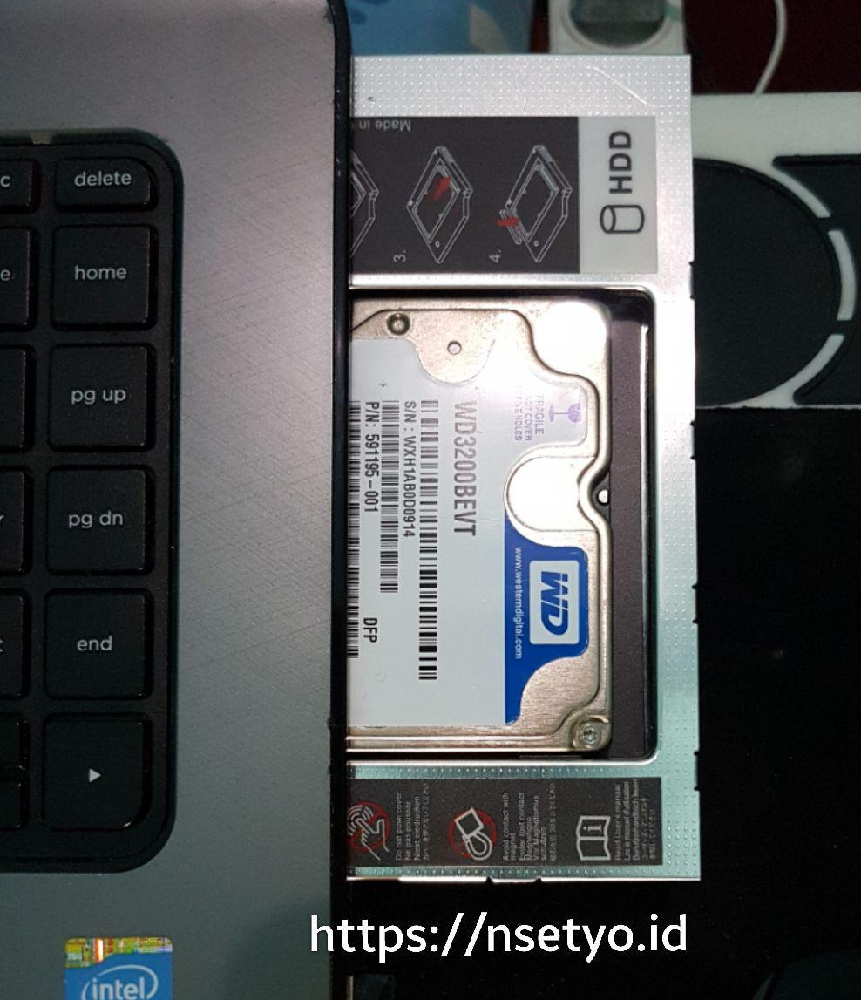
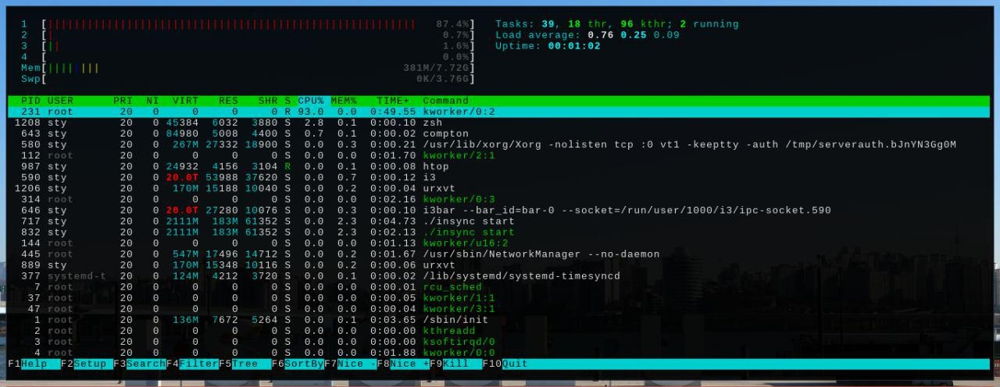
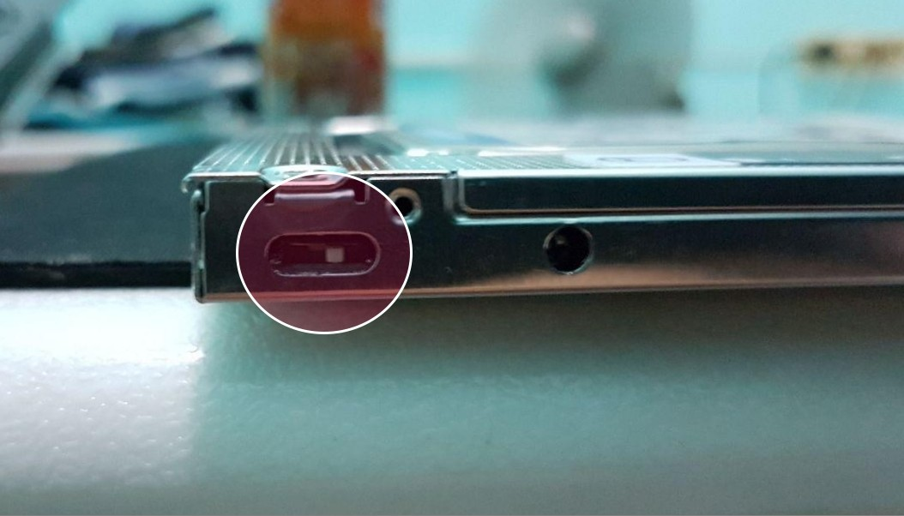

---
title:
    Mengatasi Permasalahan CPU Usage Pada Pemasangan HDD Caddy di Laptop HP
    14-R202TX
image: images/caddy2.jpg
date: 2017-04-08T13:37:31+07:00
tags:
    - Troubleshoot
---

Beberapa waktu lalu saya memutuskan untuk mengganti HDD pada laptop saya dengan
SSD. SSD memiliki keunggulan dalam kecepatan jika dibandingkan dengan HDD pada
umumnya, sayangnya dengan harga yang relatif lebih mahal. Saya membeli SSD merek
sandisk seharga Rp. 560.000 dengan kapasitas 120GB, di toko yang sama HDD 500GB
dijual seharga Rp. 590.000.

Karena kapasitasnya yang lebih kecil saya memutuskan untuk tetap meng­gu­na­kan HDD
sebagai media penyimpanan sekunder dengan menggunakan HDD Caddy. HDD Caddy akan
menggantikan posisi DVD-ROM pada laptop yang tidak pernah saya pergunakan.

<!--more-->

### Masalah Pada CPU Usage

Setelah pemasangan selesai terjadi keanehan pada grafik penggunaan CPU pada
laptop saya. Dalam keadaan _idle_ tanpa membuka aplikasi apapun penggunaan cpu
cukup tinggi, seperti terlihat pada gambar berikut:

Awalnya saya pikir masalah tersebut terjadi karena saya meng&shy;gunakan sistem
operasi GNU/Linux. Ternyata saat saya masuk menu BIOS penggunaan CPU juga
tinggi, hal ini terasa dari dengungan kipas pendingin yang tidak normal. Untuk
mengatasi permasalahan ini ternyata hanya perlu menggeser tombol _switch_ pada
HDD Caddy seperti pada gambar berikut:

---

**Catatan**

1. HDD caddy saya beli di
   [Jakmall](https://www.jakmall.com/search?q=9704838345891)
2. Sumber:
   [http://forum.notebookreview.com][http://forum.notebookreview.com/threads/hp-elitebook-8560p-wont-shutdown.655065/page-2#post8986739]
