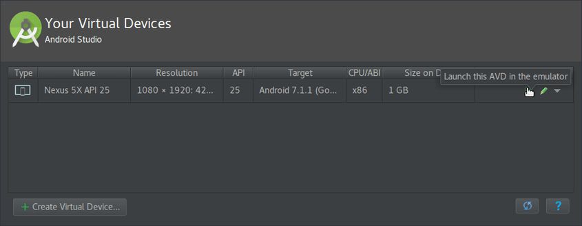

Kelanjutan dari tulisan saya
[sebelumnya](/posts/2017/04/17-install-android-studio). Terdapat kendala saat
mencoba menjalankan Android Virtual Device (AVD) melalui Android Studio. AVD
tidak berjalan setelah ditekan tombol run seperti pada gambar.



<!--more-->

AVD tidak berjalan dan tidak ada galat (_error_) yang ditam­pil­kan. Untuk
mengetahui permasalahan yang terjadi baiknya kita menjalankan AVD melalui
_command line_ agar _error_ yang terjadi dapat terlihat.

## Menjalankan AVD Melalui Command Line

Pertama, pindahkan _working directory_ ke folder di mana Android SDK berada.

```
$ cd /path/to/android-sdk/tools
```

Lihat daftar Android Virtual Device dengan perintah `./emulator -avd -list-avds`

```
$ ./emulator -avd -list-avds
Nexus_5X_API_25
```

Jalankan AVD dengan perintah `./emulator -avd Nexus_5X_API_25` ganti
Nexus_5X_API_25 dengan nama AVD yang ingin dijalankan. Setelah itu muncul pesan
galat:

```
sh: 1: glxinfo: not found
sh: 1: glxinfo: not found
emulator: WARNING: encryption is off
libGL error: unable to load driver: i965_dri.so
libGL error: driver pointer missing
libGL error: failed to load driver: i965
libGL error: unable to load driver: swrast_dri.so
libGL error: failed to load driver: swrast
X Error of failed request:  BadValue (integer parameter out of range for operation)
  Major opcode of failed request:  154 (GLX)
  Minor opcode of failed request:  24 (X_GLXCreateNewContext)
  Value in failed request:  0x0
  Serial number of failed request:  33
  Current serial number in output stream:  34
QObject::~QObject: Timers cannot be stopped from another thread
```

## Menggunakan Systemlibs

Masalah di atas dapat diatasi dengan menjalankan AVD menggunakan library yang
ada pada system dengan perintah `-use-system-libs`.

```
$ ./emulator -avd Nexus_5X_API_25 -use-system-libs
```

Menggunakan cara tersebut memang berhasil menjalankan AVD tanpa galat. Tetapi
cara tersebut tidak bisa untuk menjalankan AVD melalui Android Studio. Untuk
mengatasinya masuk ke folder emulator dalam direktori Android SDK.

```
$ cd /path/to/android-sdk/emulator/lib64/libstdc++
```

Backup lib Android Studio

```
$ mv libstdc++.so.6 libstdc++.so.6.bak
```

Link Systemlibs

```
$ ln -s /usr/lib/x86_64-linux-gnu/libstdc++.so.6
```

AVD sudah bisa dijalankan melalui Android Studio.

Catatan: Lokasi file `libstdc++.so.6` mungkin berbeda-beda tergantung distro
yang digunakan
