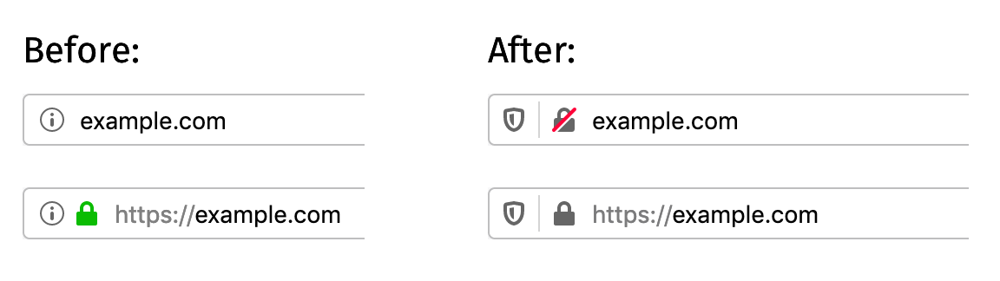
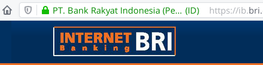

Setelah sebelumnya saya membuat artikel tentang https, saya jadi menyadari kalau
Mozilla Firefox sekarang akan menampilkan icon gembok berwarna abu-abu untuk
laman https alih-alih gembok hijau[^1].

<!--more-->

Saya pribadi lebih menyukai https digambarkan dengan icon gembok berwarna hijau,
jadi untuk mengembalikannya saya mengubah konfigurasi `about:config` pada key
`security.secure_connection_icon_color_gray.` Ubah value pada key tersebut
menjadi `false` lalu restart browser.

Sebagai tambahan kita juga bisa membuat firefox menampilkan informasi EV
(_Extended Validation_) Certificate dengan mengubah key
`security.identityblock.show_extended_validation` menjadi true

[^1]:
    https://blog.mozilla.org/security/2019/10/15/improved-security-and-privacy-indicators-in-firefox-70/
