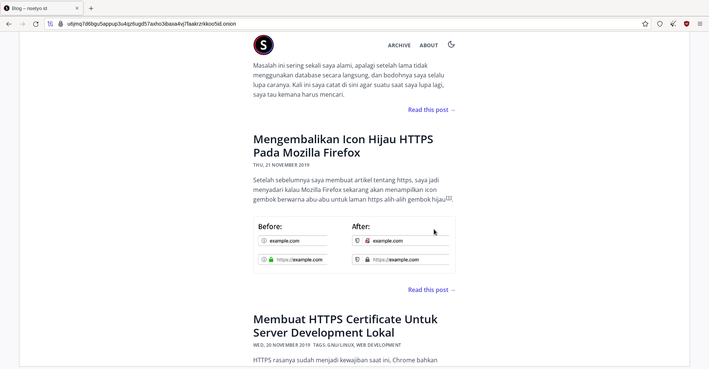

Lately, I’ve been playing around with ways to keep my online activity more
private: **onion domains**. These are special websites you can access using the
Tor network, and they keep both the site owner and visitors anonymous.

In this post, I’ll share how I made my own onion site. It was surprisingly easy,
and I’ll walk you through everything step by step.

### 🧑‍💻 Step 1: Installing Tor

First, I installed Tor on my Linux machine. If you’re using Linux too, just run:

```bash
sudo apt install tor torsocks
```

Then, I started the Tor service:

```bash
sudo systemctl start tor
```

To check if it’s working:

```bash
sudo systemctl status tor
```

If it says “active (running)”, you’re good!

### 🔍 Step 2: Checking My IP

Before using Tor, I checked my regular IP address:

```bash
wget -qO - https://api.ipify.org; echo
```

Mine was something like:

```
103.105.71.193
```

Then I used Tor to check it again:

```bash
torsocks wget -qO - https://api.ipify.org; echo
```

This time it changed to:

```
185.220.101.77
```

That means Tor is working! 🎉

### 🌐 Step 3: Setting Up the Onion Website

To make my website available as an onion site, I just had to add a few lines to
Tor’s config file. I opened the file:

```bash
sudo vim /etc/tor/torrc
```

Then added this at the bottom:

```
HiddenServiceDir /var/lib/tor/other_hidden_service/
HiddenServicePort 80 localhost:80
```

This tells Tor to make a hidden service pointing to my local web server on
port 80. After saving, I restarted Tor:

```bash
sudo systemctl restart tor
```

### 🧅 Step 4: Getting My Onion Address

Tor will create a folder with your new onion address. I just ran:

```bash
cat /var/lib/tor/other_hidden_service/hostname
```

And it gave me something like:

```bash
u6jmq7d6bgu5appup3u4qz6ugd57axho3ibaxa4vj7faakrzrkkoo5id.onion
```

That’s it — that’s my onion site! You can open it using the Tor Browser.


